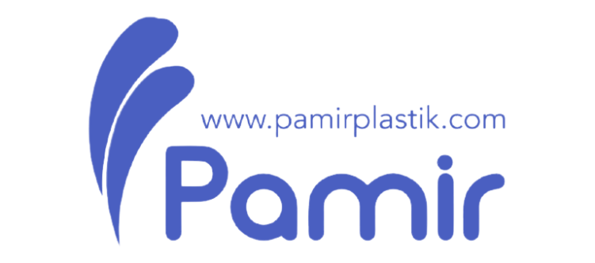

<div align="center">
  
  <!-- LOGO VEYA ANA GÖRSEL İÇİN YER -->
  

  # Pamir Plastik - Kurumsal Web & B2B Uygulaması 🚀

  ASP.NET Core 8 Web API ve MVC kullanılarak, N-Katmanlı (Clean Architecture) mimari prensipleriyle geliştirilmiş, SEO ve Güvenlik optimizasyonları yapılmış tam teşekküllü kurumsal web projesi.

  
  
  
  

</div>

---

## 🌟 Projenin Amacı ve Özeti
Bu proje, plastik ve mutfak gereçleri üreten kurumsal bir firmanın hem son kullanıcıya (B2C) hem de diğer işletmelere (B2B) ürünlerini, kataloglarını ve fuar etkinliklerini sergileyebilmesi amacıyla geliştirilmiştir. Sistem tamamen dinamik olup, özel bir **Admin Paneli** üzerinden yönetilmektedir.

## 🏗️ Mimari ve Teknolojiler

Proje, Frontend ve Backend süreçlerinin birbirinden izole edildiği, modern endüstri standartlarına uygun bir altyapıya sahiptir.

*   **Backend:** ASP.NET Core 8 Web API
*   **Frontend:** ASP.NET Core MVC (WebUI)
*   **Mimari:** N-Tier Architecture (Domain, Application, Persistence, Infrastructure, Presentation)
*   **ORM:** Entity Framework Core (Code First)
*   **Veritabanı:** Microsoft SQL Server
*   **Tasarım:** HTML5, CSS3, TailwindCSS, Responsive Design
*   **Veri İletişimi:** DTO (Data Transfer Object) pattern ve HttpClient ile API Tüketimi

## 🚀 Öne Çıkan Özellikler

- **🌍 Dinamik Çoklu Dil Desteği:** TR ve EN dilleri arasında Cookie tabanlı anlık geçiş (Localization).
- **🛡️ Gelişmiş Güvenlik (Security):** 
  - Tüm formlarda **CSRF (Cross-Site Request Forgery)** koruması (ValidateAntiForgeryToken).
  - Güvenlik HTTP Başlıkları (*X-Frame-Options, X-XSS-Protection, X-Content-Type-Options*).
  - Cookie tabanlı ve Claim destekli yetkilendirme (Auth).
  - Dışarıdan izinsiz dosya (/cvs) erişim kısıtlamaları (Middleware).
- **📈 İleri Seviye SEO Optimizasyonu:**
  - Veritabanından beslenen **Dinamik sitemap.xml** oluşturucu.
  - Sosyal medya paylaşımları için **Open Graph (OG)** ve Twitter Card meta etiketleri.
  - Canonical URL ve Hreflang dil bildirimleri.
  - Görsellerde sayfa hızını artıran **Lazy Loading** mimarisi.
- **💼 İş Başvurusu Modülü:** CV (.pdf) yükleme destekli, admin paneli entegreli İK modülü.
- **📊 Admin Dashboard:** Site ziyaretçi istatistiklerini izleyebileceğiniz modern kontrol paneli.
- **🔥 Geliştirici Boss Odası:** Easter-egg tadında, şifreli giriş yapılan özel CSS animasyonlu geliştirici ayarları paneli.

---

## 📸 Ekran Görüntüleri

*Proje görselleri (Anasayfa, Admin Paneli vb.), hosting ve canlıya alma işlemleri tamamlandıktan sonra buraya eklenecektir.*

---

## ⚙️ Kurulum ve Çalıştırma

Projeyi kendi bilgisayarınızda çalıştırmak için aşağıdaki adımları izleyin:

1.  **Projeyi Klonlayın:**
    ```bash
    git clone https://github.com/KullaniciAdiniz/PamirPlastik.git
    cd PamirPlastik
    ```

2.  **Veritabanı Bağlantısını Ayarlayın:**
    `PamirPlastik.WebApi` ve `PamirPlastik.WebUI` katmanlarındaki `appsettings.json` dosyalarını açın ve kendi SQL Server bağlantı dizgenizi (Connection String) girin.

3.  **Migration İşlemlerini Uygulayın:**
    Package Manager Console (PMC) üzerinden Persistence katmanını seçerek veritabanını oluşturun:
    ```powershell
    Update-Database
    ```

4.  **Projeyi Başlatın:**
    Visual Studio üzerinde **Multiple Startup Projects** ayarını açın:
    - `PamirPlastik.WebApi` (Start)
    - `PamirPlastik.WebUI` (Start)
    
    veya terminalden sırayla çalıştırın:
    ```bash
    dotnet run --project Presentation/PamirPlastik.WebApi
    dotnet run --project Frontends/PamirPlastik.WebUI
    ```

---

## 👨‍💻 Geliştirici

**Samet**  
Eskişehir Osmangazi Üni. Bilgisayar Programcılığı | Anadolu Üni. YBS
- GitHub: [@sametunverdi](https://github.com/sametunverdi)
- LinkedIn: [Samet Ünverdi](https://www.linkedin.com/in/sametunverdi)

*Bu proje, modern web geliştirme standartları (Clean Architecture, API Tüketimi, Security & SEO) gözetilerek kodlanmıştır.*
